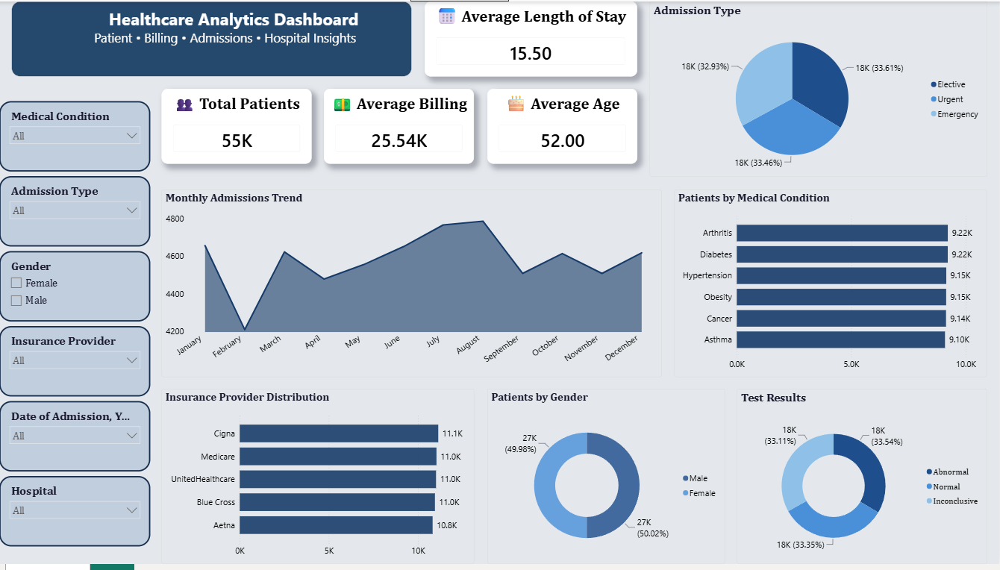

# Power BI Healthcare Analytics Dashboard

An interactive healthcare analytics dashboard built in Power BI Desktop, covering patient demographics, admissions, billing, and clinical outcomes.

## File

`Healthcare_Dashboard.pbix`

## What it covers

- **KPI summary**: Total Patients, Average Billing, Average Age, Average Length of Stay
- **Admissions**: Monthly admissions trend, breakdown by Admission Type (Elective / Urgent / Emergency)
- **Clinical**: Patients by Medical Condition, Test Results distribution (Normal / Abnormal / Inconclusive)
- **Operational**: Insurance Provider distribution, Patients by Gender
- **Filtering**: Slicers for Medical Condition, Admission Type, Gender, Insurance Provider, Date of Admission, and Hospital

## Skills demonstrated

- Interactive report design with cross-filtering slicers
- DAX measures for KPI calculations
- Power Query for data cleaning and shaping
- Custom report theming (color palette, card styling) for a polished, non-default look
- Chart selection matched to data type (donut charts for proportions, area chart for trend, horizontal bars for category comparison)

## How to use

Open in Power BI Desktop. Use the left-side slicers to filter the entire report by condition, admission type, gender, insurance provider, date range, or hospital.
